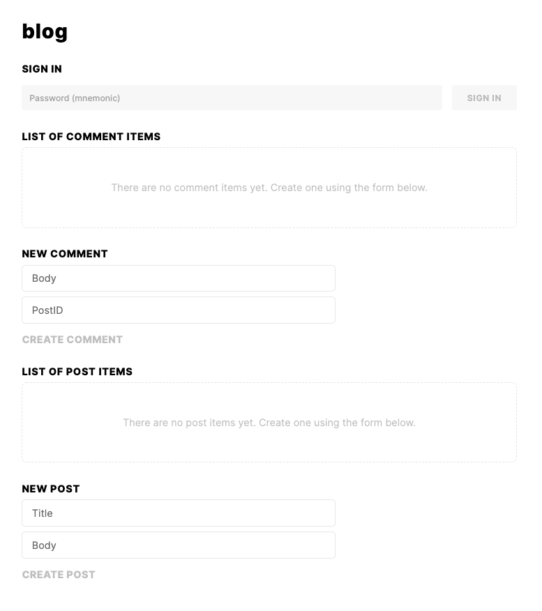

# Using the `starport type` command

## Overview

Within our base `blog` app, we've generated the following files - 

```
vue/src/store/app.js            
x/blog/client/cli/query.go      
x/blog/client/cli/queryPost.go  
x/blog/client/cli/tx.go         
x/blog/client/cli/txPost.go     
x/blog/client/rest/queryPost.go 
x/blog/client/rest/rest.go      
x/blog/client/rest/txPost.go    
x/blog/handler.go               
x/blog/handlerMsgCreatePost.go  
x/blog/keeper/post.go           
x/blog/keeper/querier.go        
x/blog/types/MsgCreatePost.go   
x/blog/types/TypePost.go           
x/blog/types/codec.go           
x/blog/types/key.go             
x/blog/types/querier.go
```

## Extending our app using `starport type`

Let's say, we want to add functionality for users to comment on posts, which would require creating a type `comment`, which can be created when a user sends a `body` and a relevant `postID`. Instead of manually performing all the same changes we made earlier and modifying it to support `comment`, we can run the following command:

```
starport type comment body postID
```

Running this command will create add all the core functionality for the type `comment` to our application, including registering entrypoints in `rest` and `cli`, as well as defining the relevant `types`, `handler`, and `keeper`.


Once this is complete, run `starport serve` and it will start up your application, as well as a rest server as well as this `vue` UI at `localhost:8080` - 




Congratulations! Your blog application is complete.
